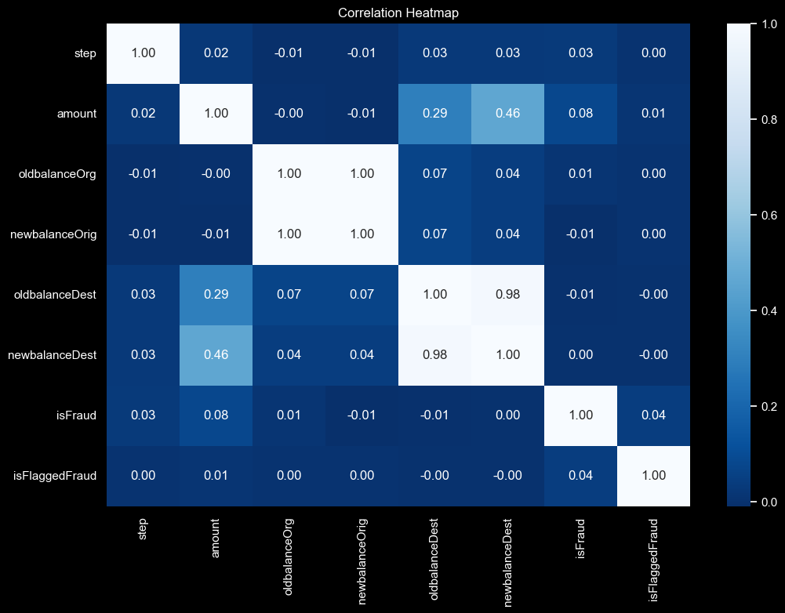

# Introduction
📉 Fraud Detection Analysis: This project explores the detection of fraudulent online payment transactions. By analyzing various features of transactions, we aim to build a model that accurately identifies fraudulent activities. This comprehensive analysis includes data preprocessing, exploratory data analysis (EDA), and machine learning techniques to create a robust fraud detection system.

🔍 Looking for Python scripts used? Check them out here: [Notebook folder](/notebook/)

### Aim of the Project:
1. Preprocess the dataset and handle categorical data.
2. Explore and visualize the relationships between features.
3. Train and evaluate a machine learning model for fraud detection.
4. Predict the likelihood of a transaction being fraudulent.

# The Analysis
Each step in this project is designed to thoroughly investigate the dataset and develop a reliable fraud detection model. Here's our approach to addressing each objective:

### 1. Data Preprocessing
* **Importing and Reading Dataset:** Initial loading and inspection of the dataset.
* **Null Value Check:** Confirming the absence of null values.
* **Categorical Transformation:** Converting categorical features into numerical values for model compatibility.

### 2. Exploratory Data Analysis (EDA)
* **Transaction Type Analysis:** Counting and visualizing the different transaction types.

* **Correlation Analysis:** Examining the correlation between features and the target variable (_isFraud_).

| Feature          | Correlation with isFraud |
|------------------|---------------------------|
| isFraud          | 1.000000                  |
| amount           | 0.076688                  |
| isFlaggedFraud   | 0.044109                  |
| step             | 0.031578                  |
| oldbalanceOrg    | 0.010154                  |
| newbalanceDest   | 0.000535                  |
| oldbalanceDest   | -0.005885                 |
| newbalanceOrig   | -0.008148                 |

### 3. Machine Learning Model
* **Data Splitting:** Dividing the dataset into training and testing sets.
* **Model Training:** Training a Decision Tree Classifier to detect fraudulent transactions.
* **Model Evaluation:** Assessing the model's performance using accuracy, precision, recall, and F1 score.

| Metric            | Training Set             | Testing Set              |
|-------------------|--------------------------|--------------------------|
| Accuracy          | 0.9999998253689343       | 0.9997375295082843       |
| Precision         | 1.0                      | 0.9998583698686616       |
| Recall            | 0.9999998251430942       | 0.9998788250753409       |
| F1 Score          | 0.9999999125715394       | 0.9998685973673836       |

### 4. Prediction
* **Transaction Classification:** Predicting whether a transaction is fraudulent based on selected features.
_e.g._
| Features                          | Classification      |
|-----------------------------------|---------------------|
| type, amount, oldbalanceOrg, newbalanceOrig | Fraud               |

## ___Key Insights___
### Data Preprocessing
- **No Null Values:** The dataset is clean with no missing values.
- **Categorical to Numerical Transformation:** Successful conversion of transaction types and target labels for better analysis.

### Exploratory Data Analysis
- **Transaction Types:** The visualization showed the distribution of various transaction types.
- **Feature Correlation:** The table identified significant correlations between certain features and fraudulent transactions.

### Machine Learning Model
- **Training and Testing:** The Decision Tree Classifier showed promising results in detecting fraud.
- **Performance Metrics:** The model achieved high accuracy, precision, recall, and F1 scores, indicating robust performance.

## 🏁 __Conclusion__
The analysis and model development indicate that the dataset can be effectively used to detect fraudulent online transactions. The Decision Tree Classifier demonstrates reliable performance, making it a valuable tool for online payment fraud detection.

# Summary
This project has enhanced our skills in data preprocessing, exploratory data analysis, and machine learning model development to address the critical issue of online payment fraud:

* __🔍 Data Exploration:__ Detailed analysis of transaction data, identifying key patterns and relationships.
* __🤖 Machine Learning:__ Developed a classification model that accurately detects fraudulent transactions.
* __📊 Statistical Validation:__ Employed rigorous metrics to validate the model's performance, ensuring reliable predictions.

Leveraging Python for data processing and analysis, and visualization tools like Plotly and Seaborn, this project provides a comprehensive solution for online payment fraud detection. 📊
